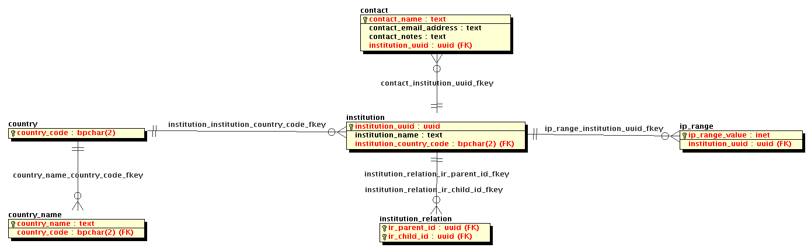

# OBP Institution Database

## Instructions

Start a database instance:
`
docker run --name obp_institutions_db -e POSTGRES_PASSWORD=mysecretpassword -e POSTGRES_DB=obp_institutions -e POSTGRES_USER=obp -d openbookpublishers/obp_institution_db
`

## Schema

